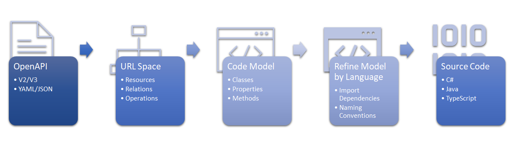

# Design Overview

## Introduction

The Kiota SDK code generation process is designed to take an OpenAPI description, parse it, and  generate a set of classes that make it simple for developers to make HTTP requests to the operations described by the OpenAPI.

## OpenAPI Description

The OpenAPI description is parsed using the Microsoft.OpenApi.NET library.  This library can accept OpenAPI V2 or V3, in JSON or YAML format and provided as either a String, Stream or TextReader.  This library can parse and validate 100K lines of OpenAPI YAML/sec and therefore meets the scaling requirements for Kiota.

The output of this library is an OpenAPIDocument object that is a DOM for the OpenAPI description.  It provides a dictionary of PathItem objects that correspond to the resources made available by the API.  However, those PathItem objects are uniquely identified by a URL path string.  Most SDK code generators take this flat list of PathItem objects, expand down to the Operation object supported for each PathItem and generate a class with methods that correspond to those Operations.  For large APIs, this creates a class with a very large surface area and makes it challenging to create readable and discoverable method names, especially for APIs with a deeply nested hierarchy.

HTTP APIs scale in size naturally due to the hierarchial nature of the URL path.  In order to take advantage of this, the generated code must use this characteristic to its advantage.  However OpenAPI descriptions don't naturally represent that hierarchy and so it must be constructed.

## URI Space Tree

Walking the list of PathItems and building a resource hierarchy is a simple process. This is also an opportunity to apply a filter to limit the PathItems that will have code generated.  Many application developers are sensitive to the size of their client applications.  By selectively including only resources that are used by a client application, libraries can be kept small.  It is essential that when additional functionality is adopted that existing generated code does not change.

## Code Model

Most SDK generator efforts use a combination of API description of DOM and templates to create source code.  Templates have several disadvantages:

- Syntax differences between languages cause semantic duplication between languages. This causes there to be lots of redundancy in templates.
- Small amounts of logic required when conditionally generating source can introduce complex syntax inside templates that is hard to test, debug and maintain.
- It is easy for the behavior and capabilities of the different languages to diverge as language templates are independent.  This can be problematic if you are trying to provide consistent feature support across languages.

Kiota takes a different approach to code generation.  The OpenAPI PathItems are analysed and a corresponding language agnostic code model is created.  This code model relies on standard object-oriented features that are available in all recent mainstream languages.

The Code Model built for Kiota is designed to support the features needed to create the thin "typing" veneer over a core HTTP library. It is not intended to be provide a comprehensive code model for any arbitrary code.  This approach of using a common code model is feasible because we are targetting modern object oriented languages and limiting the scenarios to those of making HTTP requests.

## Refine Code Model by Language

Despite the narrow scenario, there are still scenarios where in order to create idomatic source code, there will be adjustments or additions required to the code model before emitting the source code.

The changes to the model made in this section should be as minimal as possible as they will likely cause more maintenance in the future.

This section can be used to import language framework dependencies required for the generated source code.  It can also be used for updating the casing of identifiers to be those appropriate for the language.

All the different code constructs that are modelled are derived from a base CodeElement class. Some CodeElements can contain other CodeElements.  This allows traversing the CodeElement hierarchy uniformly and enables emitting source code in the desired order.  This section has the option to re-order peer elements based on language conventions.

## Generate Source Files

The last step of the process is to take the code model and translate it to language specific text.  Traversing the CodeElement hierarchy and applying a concrete LanguageWriter implementation will output the desired source code.

Implementing a language support for a new language requires, at minimum, implementing a class that derives from LanguageWriter.