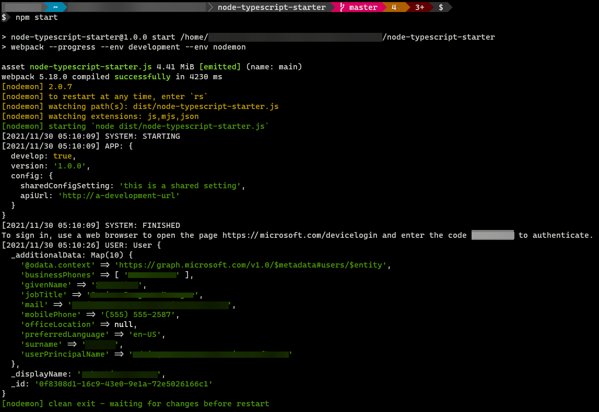

# Build SDKs for TypeScript

## Required tools

- [NodeJS 14](https://nodejs.org/en/)
- [TypeScript](https://www.typescriptlang.org/)

## Target project requirements

Before you can compile and run the target project, you will need to initialize it. After initializing the test project, you will need to add references to the [abstraction](https://github.com/microsoft/kiota/tree/main/abstractions/typescript), [authentication](https://github.com/microsoft/kiota/tree/main/authentication/typescript/azure), [http](https://github.com/microsoft/kiota/tree/main/http/typescript/fetch), and [serialization](https://github.com/microsoft/kiota/tree/main/serialization/typescript/json) packages from the GitHub feed.

## Creating target projects

> **Note:** you can use an existing project if you have one, in that case, you can skip the following section.

Execute the following command in the directory you want to create a new project.

```shell
git clone https://github.com/FreekMencke/node-typescript-starter.git
npm i
```

> **Note:** in this example the `node-typescript-starter` is used, but you can use any node + typescript template.

## Adding dependencies

### Getting access to the packages

If you have not already, you will need to create a `.npmrc` to enable access to the packages in the GitHub package feed.

1. Add a `.npmrc` file with the following content

    ```conf
    @microsoft:registry=https://npm.pkg.github.com/
    ```

1. `npm login --scope=@microsoft --registry=https://npm.pkg.github.com` (use a token with package:read, repo and SSO enabled for the Microsoft organization as the password)
1. `npm i @microsoft/kiota-authentication-azure -S`.

### Installing Kiota

The article on installing the [Kiota command line](./index.md) tool shows how to do this.

Once the package feed is accessible the following packages can be added to the project.

```shell
npm i @microsoft/kiota-abstractions -S
npm i @microsoft/kiota-authentication-azure -S
npm i @microsoft/kiota-http-fetchlibrary -S
npm i @microsoft/kiota-serialization-json -S
npm i @azure/identity node-fetch
```

Only the first package is required: kiota-abstractions. The other packages provide default implementations that you can choose to replace with your own implementations if you wish.

## Generating the SDK

Kiota generates SDKs from OpenAPI documents. The example below is a minimal OpenAPI description that describes how to call the `/me` endpoint on Microsoft Graph.

Create a file called openapi.yaml with the following contents:

```yaml
openapi: 3.0.1
info:
  title: Partial Graph API
  version: v1.0
servers:
  - url: https://graph.microsoft.com/v1.0/
    description: Core
paths:
  /me:
    get:
      responses:
        200:
          description: Success!
          content:
            application/json:
              schema:
                $ref: "#/components/schemas/microsoft.graph.user"
components:
  schemas:
    microsoft.graph.user:
      type: object
      properties:
        id:
          type: string
        displayName:
          type: string
```

You can then use the Kiota command line tool to generate the SDK classes.

```shell
.\kiota.exe -d openapi.yaml --language typescript -o .\src\kiota -c GraphServiceClient -n MicrosoftGraph
```

## Creating an application registration

> **Note:** this step is required if your client will be calling APIs that are protected by the Microsoft Identity Platform like Microsoft Graph.

To be able to authenticate against the demo application against Microsoft Graph, you will need to create an application registration.  You can do this via the Azure portal, or if you have [Microsoft Graph PowerShell](https://www.powershellgallery.com/packages/Microsoft.Graph) installed, you can use the following command to create the application.

```powershell
Connect-MgGraph -Scopes "User.Read", "Application.ReadWrite.All"
$app = New-MgApplication -DisplayName "Kiota - NodeJS" `
  -IsFallbackPublicClient `
  -SignInAudience AzureADMyOrg `
  -RequiredResourceAccess @{ "ResourceAppId" = "00000003-0000-0000-c000-000000000000"; "ResourceAccess" = @( @{ Id = "e1fe6dd8-ba31-4d61-89e7-88639da4683d"; Type = "Scope"}) }

Write-Host "Your Tenant Id is : $((Get-MgOrganization).Id)"
Write-Host "Your Client Id is : $($app.AppId)"
Disconnect-MgGraph
```

Record the value of the ClientId property of the $app object as it will be needed in a later step.

## Creating the client application

Change the `noUnusedLocals` value to `false` in the tsconfig.json at the root of your project folder.

```json
{
  "compilerOptions": {
    "target": "ES2020",
    "module": "ES2020",
    "moduleResolution": "node",
    "lib": ["dom", "es2020"],
    "allowSyntheticDefaultImports": true,
    "experimentalDecorators": true,
    "noUnusedLocals": true,
    "removeComments": true,
    "strict": true,
    "typeRoots": ["node_modules/@types"]
  },
  "include": ["src/**/*.ts"],
  "exclude": ["node_modules"],
}
```

The final step is to update the main.ts file that was generated as part of the console application to include the code below.

```typescript
import { App } from './app/app';
import { Logger } from './app/common/logger';
import { GraphServiceClient } from "./kiota/graphServiceClient";
import { FetchRequestAdapter } from "@microsoft/kiota-http-fetchlibrary";
import { User } from './kiota/models/microsoft/graph/user';
import { DeviceCodeCredential } from '@azure/identity';
import { AzureIdentityAuthenticationProvider } from '@microsoft/kiota-authentication-azure';

Logger.logTask('SYSTEM', 'STARTING');

App.run();

const core = new FetchRequestAdapter(new AzureIdentityAuthenticationProvider(new DeviceCodeCredential({
    "tenantId": "REPLACE_BY_TENANT_ID",
    "clientId": "REPLACE_BY_CLIENT_ID"
})));
const client = new GraphServiceClient(core);

async function getMe(): Promise<User | undefined> {
    return await client.me.get();
}

getMe().then((user: User | undefined) => {
    Logger.logTask('USER', user)
}).catch((e) => {
    Logger.log(e)
});

Logger.logTask('SYSTEM', 'FINISHED');
```

> **Note:**
>
> - If the target API doesn't require any authentication, you can use the **AnonymousAuthenticationProvider** instead.
> - If the target API requires an `Authorization: Bearer <token>` header but doesn't rely on the Microsoft Identity Platform, you can implement your own authentication provider by inheriting from **BaseBearerTokenAuthenticationProvider**.
> - If the target API requires any other form of authentication schemes, you can implement the **IAuthenticationProvider** interface.

## Executing the application

When ready to execute the application, execute the following command in your project directory.

```shell
npm start
```

The result should be the following :


