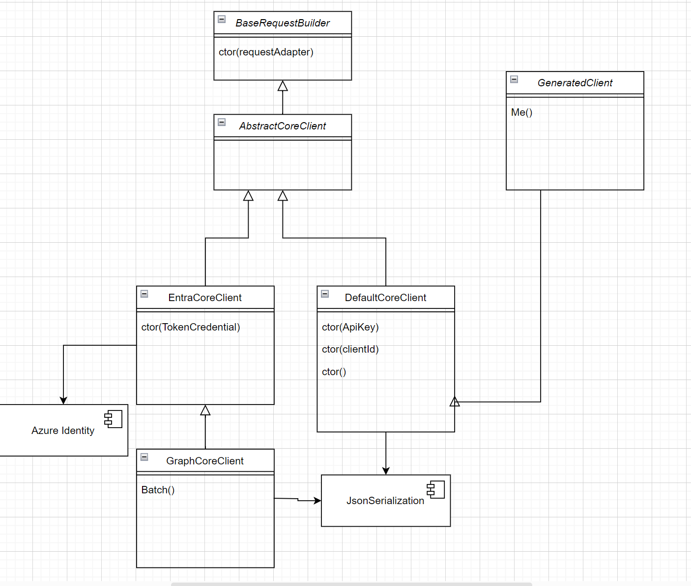

# Kiota Self-Serve

Kiota enables developers to self-serve their own API client from an OpenAPI description. This is a proposal for how we can improve the experience to make it easier to use Kiota with specialized APIs that might have core dependencies that would provide a better experience for the developer.

_This proposal is heavily influenced by scenarios that we have seen in the Microsoft Graph ecosystem. We are looking for feedback on whether this is a good approach for other APIs as well._

## Current Challenges

One of the goals for Microsoft Graph is to shift from providing pre-packaged SDKs to invite developers to self-serve their own API client from the Microsoft Graph OpenAPI description. This brings a number of benefits to the developer:

- The developer can choose the language that they want to use.
- The developer can choose the features and operations that they want to use, resulting in the smallest possible client.

This is already possible today and provide "some" value to the developer. However, there are some challenges that we have seen in the ecosystem that we would like to address.

- The developer loses core capabilities that are provided by our core libraries. For example, the developer would need to implement their own PageIterator to iterate over a collection of paged items, implement their own large file upload logic, their own batch management, etc.
- The developer loses the ability to use the same authentication provider that is used by the core libraries. For example, the developer would need to implement their own authentication provider to account for allowed hosts to be called.
- API producers might lose some telemetry if they use a custom mideleware to capture telemetry via the calls to the API.

Without these key capabiltiies, Graph developers wouldn't be able to effectively use our self-serve approach. We have seen some developers try to use the self-serve approach and then give up and use the pre-packaged SDKs because they are easier to use.

## Proposal

This proposal will focus on how Kiota can be improved to support the scenarios described above. We will focus on the Microsoft Graph scenario, but we believe that this approach could be used for other APIs as well. Another internal document for this proposal will focus on how we can improve the Microsoft Graph ecosystem to support this approach.

### Making dependencies discoverable

The first step is to make the dependencies that are used by the core libraries discoverable. We can do this by adding a new parameter to the OpenAPI description that describes the dependencies that are used by the API. We already have [documented](https://github.com/microsoft/OpenAPI/blob/main/extensions/x-ms-kiota-info.md) how to represent language information on the `x-ms-kiota-info` OpenAPI extension and this scenario would leverage it. Here is an example of what this could look like:

```yaml
openapi: 3.0.3
info:
  title: OData Service for namespace microsoft.graph
  description: This OData service is located at https://graph.microsoft.com/v1.0
  version: 1.0.1
x-ms-kiota-info:
  languagesInformation:
    CSharp:
      clientClassName: graphClient
      clientNamespaceName: Microsoft.Graph
      dependencyInstallCommand: dotnet add package {name} --version {version}
      dependencies:
        - name: Microsoft.Graph.Core
          version: 3.0.0
      structuredMimeTypes:
        - application/json
servers:
  - url: https://graph.microsoft.com/v1.0
```

This would allow us to capture the dependencies that are used by the API and the information that is needed to install them. This would also allow to specify the versions of the dependencies that are used by the API producer. For instance, they could roll out their own authentication libraries, their own serialization libraries, etc. and specify the version that they want to use. This would make it easier for the developers to use the right set of functionality without relying on the API producer documentation.

The metadata related to the `languageInformation` would be used by Kiota to generate the client code. It would be treated as default values but the developers could still override them with their preferred `clientClassName` and `clientNamespaceName`. The metadata related to the `dependencies` would be used by the developer to install the dependencies that are needed by the API. These would not be automatically installed by Kiota. When using `kiota info -l CSharp`, Kiota would use the `dependencies` metadata to generate the `dependencyInstallCommand` that the developer would need to run to install the dependencies. In cases where the API producer doesn't specify the `dependencies` metadata, Kiota would use the default dependencies that are used by the core libraries. It would also be possible to ignore the API Producer dependencies by using the `--ignore-dependencies` flag on the `kiota info -l <language>` command.

### Defining a core pattern to easily extend the client

The second step is to define a core pattern that would allow the developer to easily extend the client with the core capabilities that are provided by the core libraries. This would allow the developer to use the same authentication provider, the same telemetry provider, the same large file upload logic, etc. that are used by the core libraries.

Today, using self-serve, you have to roll out a lot of the internals of the core libraries. This would be a minimal .NET app that would use Kiota to generate the client code.

Assuming the following `kiota generate` command:

```bash
kiota generate --openapi https://aka.ms/graph/v1.0/openapi.yaml --language CSharp --output ./generated/graph --client-name "TinyGraphClient" --namespace-name "Contoso.App" --include-path "/me#GET" 
```	

```csharp	
using Azure.Identity;
using Contoso.App;
using Microsoft.Kiota.Authentication.Azure;
using Microsoft.Kiota.Http.HttpClientLibrary;

// The auth provider will only authorize requests to
// the allowed hosts, in this case Microsoft Graph
var allowedHosts = new [] { "graph.microsoft.com" };
var scopes = new [] { "User.Read" };

var options = new DeviceCodeCredentialOptions
{
    ClientId = "c723a528-361b-48a9-99dd-eb9396c00000",
    DeviceCodeCallback = (code, cancellation) =>
    {
        Console.WriteLine(code.Message);
        return Task.FromResult(0);
    },
};

var credential = new DeviceCodeCredential(options);

var authProvider = new AzureIdentityAuthenticationProvider(credential, allowedHosts, scopes: graphScopes);
var requestAdapter = new HttpClientRequestAdapter(authProvider);
var client = new TinyGraphClient(requestAdapter);

var me = await client.Me.GetAsync();
Console.WriteLine($"Hello {me.DisplayName}, your ID is {me.Id}");
```

Compared to using the `Microsoft.Graph` prepackaged SDK, there is a lot of code that the developer has to write and also needs to understand the internals of Kiota to get the same functionality. This is a barrier for developers to use the self-serve approach. We want to make it easier for developers to use the self-serve approach by providing a core pattern that would allow them to easily extend the client with the core capabilities that are provided by the core libraries.

```csharp	
using Microsoft.Graph;
using Azure.Identity;
using Contoso.App;

var scopes = new[] { "User.Read" };
var clientId = "c723a528-361b-48a9-99dd-eb9396c00000";

var options = new DeviceCodeCredentialOptions
{
    ClientId = "c723a528-361b-48a9-99dd-eb9396c0ffba",
    DeviceCodeCallback = (code, cancellation) =>
    {
        Console.WriteLine(code.Message);
        return Task.FromResult(0);
    },
};

var credential = new DeviceCodeCredential(options);
var client = new GraphServiceClient(credential, scopes);

var me = await client.Me.GetAsync();
Console.WriteLine($"Hello {me.DisplayName}, your ID is {me.Id}");
```	

The optimal experience would be to generate a client that would have all the necessary code to leverage the same capabilities the core and full libraries provide. This would allow the developer to use the same authentication provider, the same telemetry provider, the same large file upload logic, etc. that are used by the core libraries. This would also allow the API producer to capture the same telemetry that they would capture if the developer was using the pre-packaged SDKs.

```csharp
using Azure.Identity;
using Contoso.App;

var scopes = new [] { "User.Read" };

var options = new DeviceCodeCredentialOptions
{
    ClientId = "c723a528-361b-48a9-99dd-eb9396c0ffba",
    DeviceCodeCallback = (code, cancellation) =>
    {
        Console.WriteLine(code.Message);
        return Task.FromResult(0);
    },
};

var credential = new DeviceCodeCredential(options);
var client = new TinyGraphClient(credential, scopes);

var me = await client.Me.GetAsync();
Console.WriteLine($"Hello {me.DisplayName}, your ID is {me.Id}");
```

* Need an option to use a "core" base class for a generated client
* serializer settings and structured media types are associated to a "core" not a client. Should work with same media types with different serializers.
* We need a default core to simplify getting started for most users
* We need the structured mime type
* This will allow both serializers and backing store registry to be done with their singleton implementation
* Core would take on the ApiClientBuilder calls
* Core is not necessary for the generation. Cores shouldn't be required in the kiota.config.
* In every model file, inject a static property that has the key of the clientName. This would allow the backing store to know the instance it cares about.

